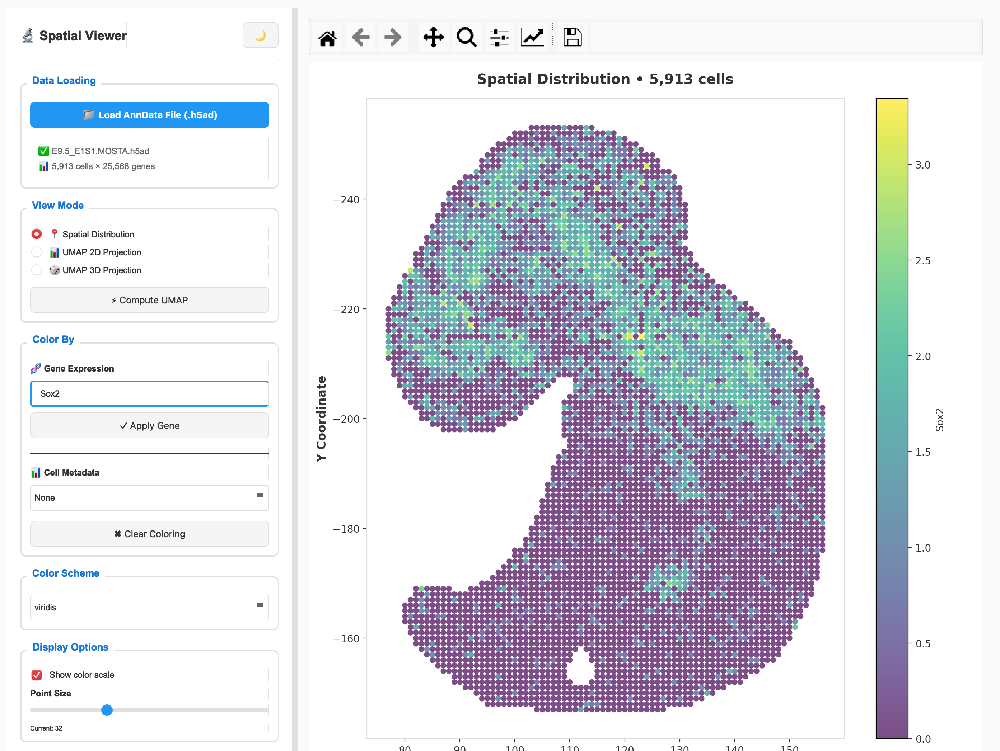
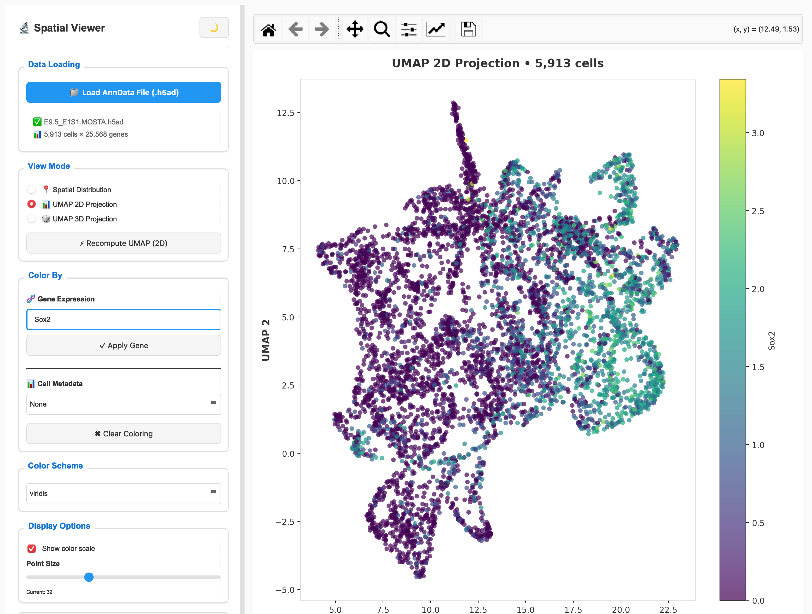
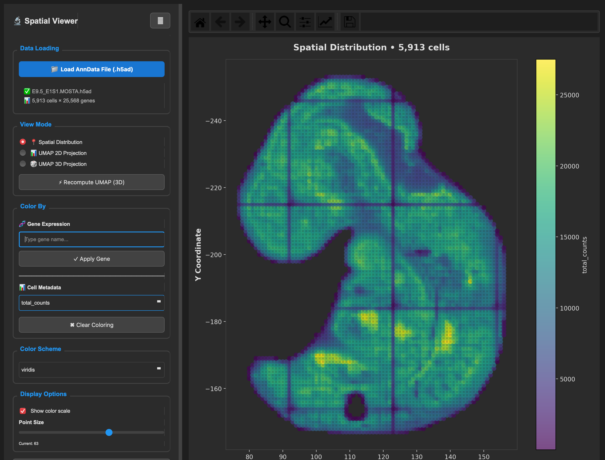

# stAge: Spatial Transcriptomics Aging Analysis

<p align="center">
  
  
  
</p>

**stAge** is a professional desktop application for analyzing aging signatures in spatial transcriptomics data. Built with PyQt5 and powered by **tAge aging clocks**, stAge provides an intuitive interface for visualizing spatial gene expression patterns and aging-related features in tissue samples.

---

## ✨ Features

### 🔬 Core Functionality
- **Interactive Spatial Visualization** - Plot spatial distribution of cells with high-quality rendering
- **UMAP Projections** - Generate and visualize 2D and 3D UMAP embeddings
- **Gene Expression Mapping** - Color cells by any gene expression with autocomplete search
- **Metadata Integration** - Visualize cell metadata and annotations
- **tAge Aging Clocks** *(Coming Soon)* - Apply transcriptomic aging clocks to spatial data

### 🎨 Visualization Options
- **Dark/Light Theme** - Eye-friendly themes for any environment
- **Customizable Color Schemes** - 10+ scientific colormaps (viridis, plasma, etc.)
- **Adjustable Point Size** - Fine-tune visualization density
- **Interactive Controls** - Pan, zoom, and export with matplotlib toolbar
- **High-Resolution Export** - Save plots as PNG, PDF, or SVG at 300 DPI

### ⚡ Performance
- **Multithreaded UMAP** - Background computation with progress tracking
- **Large Dataset Support** - Handle thousands of cells efficiently
- **Responsive UI** - Smooth interaction even during computation

---

## 📥 Installation

### Download Pre-built Executable (Recommended)

1. Go to the [Releases](https://github.com/yourusername/stAge/releases) page
2. Download the latest version for your operating system:
   - **Windows**: `stAge-windows-v1.0.0.zip`
   - **macOS**: `stAge-macos-v1.0.0.zip`
   - **Linux**: `stAge-linux-v1.0.0.tar.gz`
3. Extract the archive
4. Run the executable:
   - **Windows**: Double-click `stAge.exe`
   - **macOS**: Double-click `stAge.app` (you may need to right-click and select "Open" the first time)
   - **Linux**: Run `./stAge` from terminal

> **Note for macOS users**: If you see a security warning, go to System Preferences → Security & Privacy → General, and click "Open Anyway"

### Install from Source

```bash
# Clone the repository
git clone https://github.com/yourusername/stAge.git
cd stAge

# Create virtual environment (recommended)
python -m venv venv
source venv/bin/activate  # On Windows: venv\Scripts\activate

# Install dependencies
pip install -r requirements.txt

# Run the application
python main.py
```

**Requirements:**
- Python 3.8+
- PyQt5
- matplotlib
- scanpy
- anndata
- numpy
- pandas

---

## 🚀 Quick Start

1. **Launch stAge**
   - Run the executable or `python main.py`

2. **Load Your Data**
   - Click "📁 Load AnnData File (.h5ad)"
   - Select your spatial transcriptomics dataset in h5ad format

3. **Explore Spatial Patterns**
   - View spatial distribution of cells in tissue coordinates
   - Color by gene expression or cell metadata

4. **Compute UMAP**
   - Click "⚡ Compute UMAP" to generate dimensionality reduction
   - Configure parameters (2D/3D, neighbors, minimum distance)
   - Switch between Spatial, UMAP 2D, and UMAP 3D views

5. **Export Results**
   - Adjust visualization settings (colormap, point size)
   - Click "💾 Export Plot" to save high-quality figures

---

## 📊 Screenshots

### Spatial Distribution View
<!-- Screenshot of spatial view with gene expression coloring -->
*Spatial distribution of cells colored by gene expression*



---

### UMAP 2D Projection
<!-- Screenshot of UMAP 2D view -->
*UMAP 2D projection with cluster coloring*



---

### UMAP 3D Projection
<!-- Screenshot of UMAP 3D view -->
*Interactive UMAP 3D projection for advanced exploration*


---

### Dark Theme
<!-- Screenshot of dark theme interface -->
*Dark theme for comfortable extended analysis sessions*



---

## 🧬 tAge Aging Clocks Integration *(Coming Soon)*

stAge integrates **tAge transcriptomic aging clocks** to provide:

- **Biological Age Estimation** - Calculate tissue-specific biological age from spatial transcriptomics
- **Aging Signature Mapping** - Visualize spatial distribution of aging-related gene signatures
- **Comparative Analysis** - Compare chronological vs. biological age across tissue regions
- **Custom Clock Models** - Apply pre-trained or custom-trained aging clock models

*Stay tuned for updates on this exciting feature!*

---

## 📋 Data Format Requirements

stAge accepts **AnnData** files (.h5ad) with the following structure:

### Required Fields:
- `adata.X` - Gene expression matrix (cells × genes)
- `adata.obsm['spatial']` or `adata.obsm['X_spatial']` - Spatial coordinates (cells × 2)

### Optional Fields:
- `adata.obs` - Cell metadata (cluster labels, cell types, etc.)
- `adata.obsm['X_umap']` - Pre-computed UMAP coordinates
- `adata.uns['neighbors']` - Pre-computed neighbor graph

### Example Data Preparation:

```python
import scanpy as sc
import numpy as np

# Load your data
adata = sc.read_h5ad("your_data.h5ad")

# Ensure spatial coordinates exist
# If you have x, y coordinates in adata.obs:
adata.obsm['spatial'] = adata.obs[['x', 'y']].values

# Optional: Precompute UMAP for faster loading
sc.pp.neighbors(adata)
sc.tl.umap(adata, n_components=2)

# Save
adata.write("your_data_prepared.h5ad")
```

---

## 🛠️ Troubleshooting

### Issue: "No spatial coordinates found"
- **Solution**: Ensure your h5ad file contains `adata.obsm['spatial']` or `adata.obsm['X_spatial']`

### Issue: Application won't start on macOS
- **Solution**: Right-click the app, select "Open", and click "Open" in the security dialog

### Issue: UMAP computation fails
- **Solution**: Try reducing the number of neighbors or check that your data has enough cells (minimum ~100)

### Issue: Slow performance with large datasets
- **Solution**: Consider downsampling your data or using a machine with more RAM

For additional help, please [open an issue](https://github.com/yourusername/stAge/issues) on GitHub.

---

## 📝 Citation

<!-- If you use stAge in your research, please cite:

```bibtex
@software{stAge2024,
  title={stAge: Spatial Transcriptomics Aging Analysis},
  author={Your Name},
  year={2024},
  url={https://github.com/yourusername/stAge}
}
```

*tAge aging clocks citation (coming soon)* -->

---

## 📄 License

This project is licensed under the MIT License - see the [LICENSE](LICENSE) file for details.

---

## 👥 Authors

- **Dmitrii Glubokov** - *Initial work* - [YourGitHub](https://github.com/dglubokov)

---

## 🙏 Acknowledgments

- Built with [PyQt5](https://www.riverbankcomputing.com/software/pyqt/) for the user interface
- Powered by [Scanpy](https://scanpy.readthedocs.io/) for single-cell analysis
- Uses [AnnData](https://anndata.readthedocs.io/) for data structures
- Visualization with [Matplotlib](https://matplotlib.org/)

---

## 📞 Contact

- **Issues**: [GitHub Issues](https://github.com/yourusername/stAge/issues)

---

<p align="center">
  Made with ❤️ for the spatial transcriptomics community
</p>
